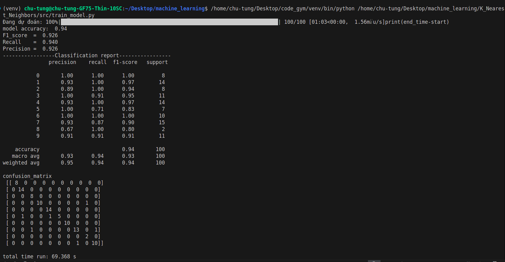
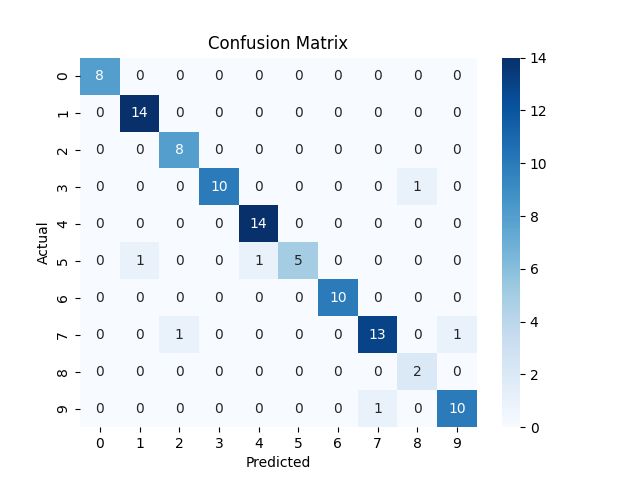
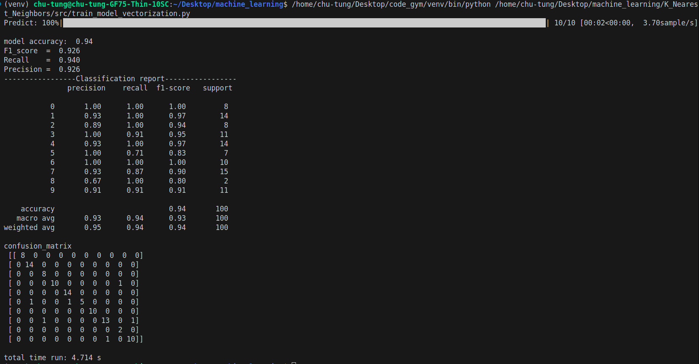
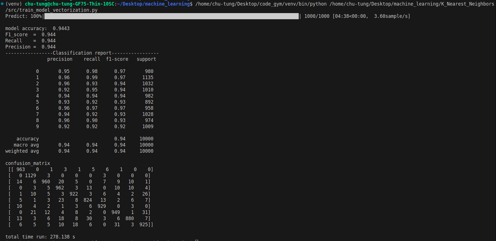
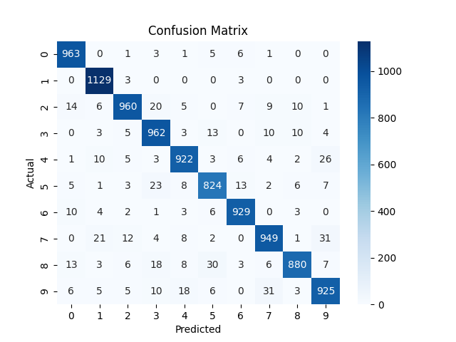

 <h1 align="center">K Nearest Neighbors</h1>

# Giới thiệu

KNN (K-Nearest Neighbors) là một trong những thuật toán học có giám sát đơn giản nhất được sử dụng nhiều trong khai phá dữ liệu và học máy. Ý tưởng của thuật toán này là nó không học một điều gì từ tập dữ liệu học (nên KNN được xếp vào loại lazy learning), mọi tính toán được thực hiện khi nó cần dự đoán nhãn của dữ liệu mới. 
Lớp (nhãn) của một đối tượng dữ liệu mới có thể dự đoán từ các lớp (nhãn) của k hàng xóm gần nó nhất.

# Cách hoạt động
ví dụ: cho trước hai bộ dữ liệu màu xanh và màu đỏ như hình bên dưới

vậy khi có một điểm mới cần phân lớp là điểm màu đen thì sao?

➡️Ta sẽ đi tính toán khoảng cách từ điểm cần phân lớp này tới các điểm của hai bộ dữ liệu xanh và đỏ. Khi ta sẽ có khoảng cách rồi thì
ta sẽ cho k điểm gần nhất với điểm cần phân lớp bỏ phiếu nếu số phần tử của lớp nào nhiều hơn thì điểm cần phân lớp sẽ thuộc lớp nhiều hơn đó. 
Số k sẽ là số lẻ. Với trường hợp với bộ dữ liệu có số lượng class hơn hai class và có hai hoặc nhiều hơn hai lớp có số lượng phần tử gần nhất bằng nhau thì điểm dự đoán sẽ được chọn theo thứ tự các số.

✅ Ưu điểm:
- Thuật toán đơn giản, dễ dàng triển khai, dễ giải thích.
- Độ phức tạp tính toán nhỏ.
- Xử lý tốt với tập dữ liệu nhiễu

❌ Nhược điểm:
- Với K nhỏ dễ gặp nhiễu dẫn tới kết quả đưa ra không chính xác
- Cần nhiều thời gian để tính toán khoảng cách với tất cả các điểm trong tập dữ liệu.
- Cần chuyển đổi kiểu dữ liệu thành các yếu tố định tính.

# Hàm tính khoảng cách
Có ba hàm tính toán khoảng cách điển hỉnh giữa hai điểm đã biết như sau.

  

# Kiểm thử

Chạy thử bộ dữ liệu Mnist với bộ Train có kích thước 60000 samples và 784 features và bộ Test có 10000 samples và 784 features. Ta lấy ra khoảng 100 samples từ bộ Test để kiểm thử mô hình hoạt động đúng không.

  
  
<em>Accuracy and Metrics evaluation (Euclidean)</em>

  
  
<em>Confusion Matrix</em>

Thấy rằng độ chính xác của mô hình vào khoảng 94% cũng là một con số ở mức khá. Tuy nhiên, có thể thấy thời gian chạy 100 samples test đã lên tới hơn 69s.

❓ Có cách nào làm nó chạy nhanh hơn không?

✅ Một giải pháp đơn giản giúp cải thiện tốc độ của mô hình là véc tơ hoá tính toán. Thay vì tính toán duyệt qua từng điểm của bộ train để tính toán khoảng cách với điểm cần xét thì ta sử dụng ma trận để tăng tốc độ tính toán.

Hãy xem giải pháp này có khả thi không?

❌Với ma trận x_test kích thước [10000,784] và ma trận x_train kích thước [60000,784] ⟹ ma trận khoảng cách D có kích thước [10000,60000]. Tính thử dung lượng của ma trận 10000 × 60000 × 4 bytes = 2.4 × 10^9 bytes = 2400000000 bytes (với kiểu float32 <=> 4 byte), lên tới 2.4 GB (gigabyte) quá lớn. Có thể máy yếu không đủ dung lượng tính toán.

✅Tuy nhiên ta có giải pháp cho vấn đề dung lượng quá lớn như này. Đó là đưa nhỏ dừng epochs vào theo từng đợt cho mô hình tính toán. 

Vậy làm cách nào để chuyển từ tính toán tuần tự thành tính toán theo kiểu ma trận?

- Xét hàm khoảng cách Euclidean
  
$$
d(\mathbf{x_test}, \mathbf{x_train}) = \sqrt{ \sum_{i=1}^n (x_{test} - x_{train})^2 }
$$

ta thấy 

$$
(x_{test} - x_{train})^2 = x_{test}^2 + x_{train}^2 - 2. x_{test}. x_{train}
$$

  

  

  

# Kiểm thử với véc tơ hoá

  
    
<em>Accuracy and Metrics evaluation (Euclidean)</em>

  
    
<em>Confusion Matrix</em>

✅Thời gian được rút ngắn xuống khoảng 10 lần so với cách dòng vòng lặp.

  
      
<em>Fit 10000 samples (Euclidean)</em>

  
      
<em>Confusion Matrix 10000 smaples</em>

